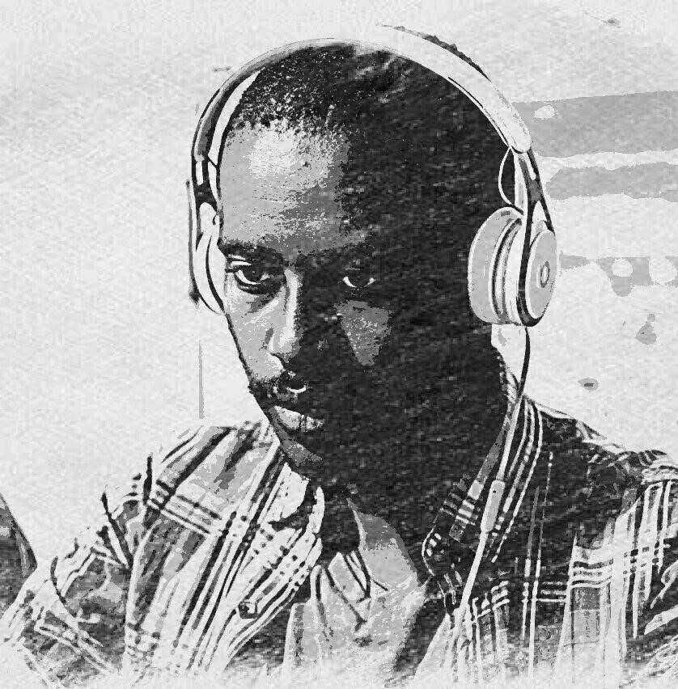

<!DOCTYPE html>
<html lang="en">

<head>
    <meta charset="UTF-8">
    <meta name="viewport" content="width=device-width, initial-scale=1.0">
    <meta http-equiv="X-UA-Compatible" content="ie=edge">
    <link rel="stylesheet" href="materialize/css/materialize.css">
    <title>Resume</title>

    

</head>

<body>

    <header>
        <!-- Side-nav (large screens) -->
        <ul id="slide-out" class="sidenav sidenav-fixed grey lighten-2">
            

                
            

            </li>
            <h4 class="center">Yohanes Fikru</h4>
            <li><a class="waves-effect waves-light" href="index.html"><i
                        class="material-icons">format_align_center</i>Resume</a></li>
            <li><a class="waves-effect waves-light" href="activities.html"><i
                        class="material-icons">assistant_photo</i>Clubs and Activities</a></li>
            <li><a class="waves-effect waves-light" href="portfolio.html"><i class="material-icons">code</i>Projects</a>
            </li>

            <li><a class="waves-effect waves-light" href="contact.html"><i
                        class="material-icons">contacts</i>Contact</a></li>
            <!-- a row of social media icons -->
            

            

            <li></li>

        </ul>
        <!-- for large screens: page indicator -->
        

            <nav class="nav-wrapper grey darken-4 z-depth-4">
                

                    <a href="home.html" class="brand-logo">Resume</a>
                

            </nav>
        

        <!-- for med and small screens -->
        

            <nav class="nav-wrapper grey darken-4 z-depth-4">
                

                    <a href="home.html" class="brand-logo" style="padding-left: 1vw">Yohanes Fikru</a>
                    <a href="" class="sidenav-trigger" data-target="mobile-menu">
                        <i class="material-icons">menu</i>
                    </a>
                    <ul class="sidenav grey lighten-2" id="mobile-menu">
                        

                            
                        

                        </li>
                        <h4 class="center black-text">Yohanes Fikru</h4>
                        <li><a class="waves-effect waves-light" href="index.html"><i
                                    class="material-icons">format_align_center</i>
                                Resume</a></li>
                        <li><a class="waves-effect waves-light" href="activities.html"><i
                                    class="material-icons">assistant_photo</i>Clubs and Activities</a></li>
                        <li><a class="waves-effect waves-light" href="portfolio.html"><i class="material-icons">code</i>
                                Projects</a></li>
                        <li><a class="waves-effect waves-light" href="contact.html"><i
                                    class="material-icons">contacts</i>
                                Contact</a></li>
                        <!-- a row of social media icons -->
                        

                        

                        <li></li>
                        <li></li>
                    </ul>
                

            </nav>
        

    </header>

    <main class="grey darken-4">

        

            

                <!-- Education -->
                

                    

                        <h3 class="blue-text"><i class="material-icons">school</i> Education</h1>
                            
Bole Preparatory School

                            
11 & 12 

                            
Adama Science and Technology University

                            
Bachelor of Computer Science and Engineering (since 2016)

                    

                

                <!-- Certifications -->
                

                    

                        <h3 class="green-text"><i class="material-icons">beenhere</i> Certifications</h1>
                            
Mobile Maintanance, SATCOM

                            
 2012

                            
Chess Coach, Addis Ababa Chess Federation

                            
1st Level (2015)

                    

                

                <!-- Achivements -->
                

                    

                        <h3 class="yellow-text text-darken-2"><i class="material-icons">grade</i> Achivements</h3>
                        
National Champion, 3rd Ethiopian Colligite Programming Contest

                        
 Hosted by Adama Science and Technology University

                        
September, 2018

                        
Best Delegate, Ethio-MUN Conference

                        
Hosted by Mekele University

                        
May, 2017

                    

                

            

            <!-- Work Summery -->
            

                

                    

                        <h3 class="amber-text text-darken-4"><i class="material-icons">subject</i> Work
                            Summery</h1>
                            
Freelance Market Research

                            
 Orange Switch, 2017-2018

                            

                                Worked in Adama going to Sales points of the client and collecting overall
                                information.
                            

                            
Intern - Unity Developer

                            
Eternal Media and Communication, 2019

                            

                                Using Unity Game Engine to create games and content for Virtual Reality devices
                            

                    

                

                <!-- Proffesional Skills -->
                

                    <h3 class="cyan-text text-darken-2"><i class="material-icons">work</i> Professional Skills</h3>
                    

                        

                            
Leadership

                            
Web Design

                            
HTML, CSS3 & JavaScript

                            
Materiallize CSS framework

                        

                        

                            
Photography

                            
Chess Coaching

                            
Game Development (Unity)

                            
C++ programming

                        

                    

                

                <!-- Leadership Positions -->
                

                    <h3 class="purple-text text-lighten-1">
                        <i class="material-icons">golf_course</i> Leadership Positions
                    </h3>
                    

                        

                            Vice-President,
                        

                        Computer Science and Engineering Club (CSEC-ASTU)
                    

                    

                        

                            Cheif of Staff,
                        

                        Model United Nations (MUN-ASTU)
                    

                    

                        

                            

                                

                                    Student Representative,
                                

                                Student Councel, High School
                            

                        

                        

                            

                                

                                    President,
                                

                                Mini Media, High School
                            

                        

                    

                

            

        

    </main>

    <footer>
        <!-- Bottom Footer -->
        

            

                Developed in Sep 2019 by Yohanes Fikru.
                <a class="waves-effect waves-light btn-flat modal-trigger black" href="#dev_info">Click Here for
                    More</a>
            

        

        <!-- Developer Modal -->
        

            

                <h4>Made with: <a href="#">Materialize CSS</a></h4>
            

        

    </footer>

    <!-- js scripts -->
    
    

    
</body>

</html>